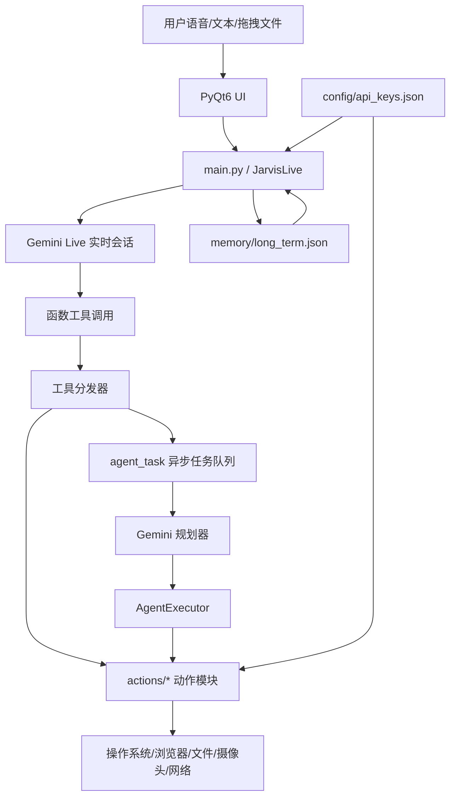

# MARK XXXIX 软件架构与技术实现分析

## 1. 项目定位

MARK XXXIX 是一个 Python 实现的跨平台桌面 AI 助手。项目目标是通过实时语音、文本输入、屏幕/摄像头感知和系统工具调用，把自然语言意图转换为本机操作、浏览器自动化、文件处理、代码生成、提醒、消息发送等实际动作。

从代码结构看，该项目不是传统 Web 后端或前端应用，而是一个本地运行的桌面智能体系统，核心运行时由 PyQt6 桌面界面、Gemini Live 实时音频会话、工具调用分发层和一组本机动作模块组成。

## 2. 总体架构

项目可以按以下层次理解：



主要分层如下：

| 层次 | 主要文件/目录 | 职责 |
| --- | --- | --- |
| 桌面界面层 | `ui.py` | PyQt6 窗口、HUD、日志、文本输入、麦克风状态、文件拖拽、首次配置界面 |
| 实时会话层 | `main.py` | 连接 Gemini Live，处理音频输入输出、工具声明、工具调用分发、会话重连 |
| 智能体编排层 | `agent/` | 多步骤任务规划、执行、错误恢复、异步任务队列 |
| 工具能力层 | `actions/` | 操作系统、浏览器、文件、屏幕、代码、游戏、消息、天气等具体能力 |
| 记忆与配置层 | `memory/`, `config/` | API Key、本地长期记忆、提示词上下文注入 |
| 系统提示词 | `core/prompt.txt` | 定义助手身份、工具路由规则、响应风格和记忆策略 |

## 3. 启动与运行流程

入口是 `main.py` 的 `main()`：

1. 创建 `JarvisUI("face.png")`。
2. UI 等待用户配置 Gemini API Key。
3. 后台线程创建 `JarvisLive` 并运行 `asyncio.run(jarvis.run())`。
4. `JarvisLive.run()` 通过 `google.genai.Client(...).aio.live.connect(...)` 连接 Gemini Live 模型。
5. 建立四个并发异步任务：
   - `_send_realtime()`：把麦克风 PCM 数据发送给模型。
   - `_listen_audio()`：通过 `sounddevice.InputStream` 采集麦克风音频。
   - `_receive_audio()`：接收模型音频、转写文本和工具调用。
   - `_play_audio()`：通过 `sounddevice.RawOutputStream` 播放模型返回音频。
6. 如果连接异常，循环等待 3 秒后重连。

语音链路采用单声道 PCM：输入采样率 16 kHz，输出采样率 24 kHz，块大小 1024。为了避免回声式自监听，麦克风回调会检查 `_is_speaking` 和 UI 静音状态，助手说话时不继续向模型发送麦克风输入。

## 4. UI 架构

`ui.py` 是单文件 PyQt6 桌面界面，主要组件包括：

- `MainWindow`：主窗口，承载左右面板、输入框、日志、状态、系统指标和文件拖拽区。
- `JarvisUI`：对外暴露给 `main.py` 和工具模块的 UI 适配器，提供 `write_log()`、`set_state()`、`wait_for_api_key()`、`current_file` 等方法。
- `SetupOverlay`：首次启动时保存 API Key 和 OS 配置。
- `FileDropZone`：支持用户拖拽文件，供 `file_processor` 处理。
- `HudCanvas`、`MetricBar`、`LogWidget`：用于视觉动效、系统指标和日志输出。

UI 与业务逻辑之间没有使用复杂的 MVVM/MVC 分层，而是通过 `JarvisUI` 作为轻量适配层隔离 PyQt 对象。后台线程和异步任务通过 Qt signal 或封装方法把日志和状态更新回 UI。

## 5. Gemini Live 与工具调用机制

`main.py` 中的 `TOOL_DECLARATIONS` 定义了可供 Gemini 调用的函数工具，包括：

- `open_app`
- `web_search`
- `weather_report`
- `send_message`
- `reminder`
- `youtube_video`
- `screen_process`
- `computer_settings`
- `browser_control`
- `file_controller`
- `desktop_control`
- `code_helper`
- `dev_agent`
- `agent_task`
- `computer_control`
- `game_updater`
- `flight_finder`
- `shutdown_jarvis`
- `file_processor`
- `save_memory`

`_build_config()` 会把当前时间、长期记忆和 `core/prompt.txt` 合并为系统提示词，再附加工具声明，创建 `types.LiveConnectConfig`。模型输出音频，同时开启输入/输出转写。

当 Gemini 返回 `response.tool_call` 时，`_receive_audio()` 会逐个调用 `_execute_tool(fc)`。分发器按工具名调用 `actions` 目录中的对应函数。大多数阻塞工具通过 `loop.run_in_executor(None, ...)` 放入线程池执行，避免阻塞实时音频接收循环。视觉工具 `screen_process` 会单独开启线程，因为它维护独立的视觉 Live 会话并直接语音回复。

## 6. 智能体编排层

`agent/` 目录处理复杂多步骤任务，主要由以下模块组成。

### 6.1 规划器

`agent/planner.py` 使用 `google.generativeai` 的 `gemini-2.5-flash-lite` 或 `gemini-2.5-flash` 根据用户目标生成 JSON 计划。计划结构包含目标、步骤、工具名、描述、参数和关键性标记。

规划器提示词明确限制：

- 最多 5 步。
- 只能使用列出的工具。
- 信息检索必须使用 `web_search`。
- 保存内容必须使用 `file_controller`。
- 不允许使用 `generated_code`，但执行器中仍保留了该兜底能力。

如果模型返回非 JSON 或结构无效，会退化为单步 `web_search` 计划。

### 6.2 执行器

`agent/executor.py` 的 `AgentExecutor.execute()` 负责：

1. 调用 `create_plan(goal)` 生成计划。
2. 按顺序执行每一步。
3. 将工具结果记录到 `step_results`。
4. 对文件写入步骤自动注入前序搜索结果，并尝试翻译为用户目标语言。
5. 单步失败时最多尝试 3 次。
6. 调用错误分析器决定重试、跳过、中止或重规划。
7. 最多重规划 2 次。
8. 完成后调用 Gemini 生成一句简短总结。

执行器中的 `_call_tool()` 是另一个工具分发器，和 `main.py` 的实时分发器存在一定重复。区别是 `main.py` 面向实时对话中的单次工具调用，`AgentExecutor` 面向多步骤计划执行。

### 6.3 错误恢复

`agent/error_handler.py` 使用 Gemini 分析失败步骤，返回 `retry`、`skip`、`replan`、`abort` 四类决策。对于关键步骤，`skip` 会被强制转为 `replan`。当需要修复时，`generate_fix()` 会生成替代步骤，通常转为 `code_helper` 执行。

### 6.4 任务队列

`agent/task_queue.py` 提供单例任务队列，支持优先级、取消、状态查询和后台线程执行。`agent_task` 工具会把复杂目标提交到该队列，避免长期任务阻塞实时对话。

## 7. Actions 工具层实现

`actions/` 是项目的能力插件层。每个模块通常暴露一个入口函数，参数为 `parameters` 字典，并可选接收 `player` 或 `speak` 回调。

### 7.1 浏览器自动化

`actions/browser_control.py` 使用 Playwright 实现浏览器控制，支持 Chrome、Edge、Firefox、Opera、Brave、Vivaldi、Safari 等浏览器。它包含：

- 浏览器可执行文件发现。
- 真实用户 profile 目录探测。
- 持久化浏览器上下文。
- 多浏览器会话注册表。
- URL 打开、搜索、点击、输入、滚动、截图、标签页控制等动作。

该模块是项目中最重的自动化模块之一，体现了跨平台和多浏览器适配的主要复杂度。

### 7.2 本机系统控制

`actions/computer_settings.py` 和 `actions/computer_control.py` 负责系统级操作：

- 音量、亮度、窗口管理、快捷键、标签页导航、锁屏、关机/重启等。
- 鼠标、键盘、剪贴板、截图、屏幕元素查找和点击。
- 主要依赖 `pyautogui`、`pyperclip`、系统命令和少量平台专用 API。

`computer_settings.py` 偏语义化系统动作，`computer_control.py` 偏低层输入控制。

### 7.3 文件管理与文件处理

`actions/file_controller.py` 提供文件系统操作，包括列目录、创建、删除、移动、复制、重命名、读取、写入、查找、磁盘占用和桌面整理。它设置了 `_SAFE_ROOTS = [Path.home()]`，默认只允许操作用户 home 目录下的路径；删除使用 `send2trash`，并保护 Desktop、Downloads、Documents、Pictures、Music、Videos 和 Home 等关键目录。

`actions/file_processor.py` 面向用户拖拽文件，按类型处理图片、PDF、文本/Word、CSV/Excel、JSON/XML、代码、音频、视频、压缩包和 PPTX。它综合使用 Pillow、OpenCV、Gemini、多媒体工具或标准库完成摘要、提取、转换、压缩、分析等动作。

### 7.4 视觉能力

`actions/screen_processor.py` 负责屏幕和摄像头感知：

- 屏幕截图依赖 `mss`。
- 摄像头捕获依赖 OpenCV。
- 图片压缩依赖 Pillow，默认缩放到 640x360、JPEG 质量 60。
- 视觉分析使用独立的 Gemini Live 原生音频模型会话。
- `_VisionSession` 在后台线程中维护 asyncio loop、音频输出队列和视觉请求队列。

该设计让视觉分析可以绕过主对话模型直接播报结果，但也引入了第二套实时会话生命周期管理。

### 7.5 代码与项目生成

`actions/code_helper.py` 支持写代码、编辑代码、解释代码、运行代码、构建并自动修复。它会根据描述识别意图，生成文件，执行解释器，并在检测到错误时调用 Gemini 修复。支持 Python、JavaScript、TypeScript、Shell、PowerShell 等多种解释器。

`actions/dev_agent.py` 更进一步，用于生成多文件项目。它会规划项目文件、写入文件、安装依赖、运行项目、解析错误并多轮修复，默认输出到桌面 `JarvisProjects`。

### 7.6 其他能力

- `web_search.py`：优先使用 Gemini 搜索式回答，补充 DuckDuckGo 搜索和比较。
- `youtube_video.py`：搜索/播放 YouTube、获取字幕、摘要、趋势视频。
- `weather_report.py`：调用公开天气接口或网络请求返回天气。
- `send_message.py`：通过桌面应用或网页方式发送消息。
- `reminder.py`：跨平台创建提醒任务，Windows 使用 Task Scheduler，macOS/Linux 使用系统调度能力。
- `game_updater.py`：Steam/Epic 游戏安装、更新、下载状态和定时任务。
- `flight_finder.py`：构造 Google Flights 搜索，通过浏览器检索并用 Gemini 解析结果。
- `desktop.py`：桌面壁纸、整理、清理和统计。
- `open_app.py`：跨平台应用启动。

## 8. 数据与配置

### 8.1 API 配置

`memory/config_manager.py` 和 UI 首次配置流程会把 Gemini API Key 保存到：

```text
config/api_keys.json
```

多个模块直接读取该文件。部分模块还会写入 `os_system`、`camera_index` 等配置项。

### 8.2 长期记忆

`memory/memory_manager.py` 使用 JSON 文件保存长期记忆：

```text
memory/long_term.json
```

记忆结构分为：

- `identity`
- `preferences`
- `projects`
- `relationships`
- `wishes`
- `notes`

每个条目保存 `value` 和 `updated` 日期。`format_memory_for_prompt()` 会把记忆格式化后注入主会话系统提示词。记忆文件有长度控制，超过 `MEMORY_MAX_CHARS = 2200` 时按更新时间删除旧条目。

### 8.3 系统提示词

`core/prompt.txt` 定义了助手的核心协议，包括：

- 高效、专业、直接。
- 慢工具调用前简短说明。
- 视觉工具调用后保持沉默。
- 单次调用策略。
- 单一 OS 动作走 `computer_settings`。
- 复杂 3 步以上任务才走 `agent_task`。
- 自动保存重要个人信息。

## 9. 并发模型

项目同时使用了三类并发机制：

1. `asyncio`：主 Gemini Live 会话、音频输入输出、工具响应发送。
2. `threading`：UI 后台启动、任务队列、视觉会话、长耗时工具隔离。
3. executor 线程池：`loop.run_in_executor()` 执行阻塞工具。

这种设计适合桌面实时语音应用，但复杂度较高。需要特别关注线程间 UI 调用、音频队列背压、工具执行超时和会话重连后的状态清理。

## 10. 跨平台实现方式

项目宣称支持 Windows、macOS、Linux。跨平台适配主要体现在：

- 应用启动：`open_app.py` 按平台分别实现。
- 浏览器控制：`browser_control.py` 为各平台维护 profile 路径和可执行文件查找逻辑。
- 系统设置：`computer_settings.py` 对音量、亮度、WiFi、关机等动作分别调用平台工具或快捷键。
- 提醒：`reminder.py` 分别使用 Windows Task Scheduler、macOS/Linux 调度方式。
- 摄像头：OpenCV backend 按 Windows/macOS/Linux 选择。
- 文件目录：Desktop/Downloads/Documents 等路径按平台做了简单 XDG 或 home 目录解析。

不过 `requirements.txt` 中包含 `comtypes`、`pycaw`、`win10toast`、`pywinauto` 等 Windows 相关依赖，README 也提示部分 OS 特定依赖未完全列入。因此跨平台能力更多依赖运行时分支和可选依赖，并非完全统一的安装体验。

## 11. 安全边界与风险点

项目具备直接控制本机、浏览器、文件、消息和代码执行的能力，因此安全边界非常关键。

已存在的保护包括：

- `file_controller.py` 限制文件操作在用户 home 目录下。
- 删除文件默认使用回收站，不做永久删除。
- 保护关键用户目录不被删除。
- `core/prompt.txt` 要求不猜测结果，必须调用工具。
- `planner.py` 限制多步骤计划最多 5 步。

主要风险点包括：

- API Key 明文保存在 `config/api_keys.json`。
- `code_helper.py`、`dev_agent.py` 和执行器的 generated code 能生成并运行本地代码，风险较高。
- 多个工具可执行系统命令、安装依赖、控制浏览器真实 profile，需要明确用户授权边界。
- `main.py` 和 `agent/executor.py` 各有一套工具分发逻辑，工具能力更新时容易出现声明、实时分发和 Agent 分发不一致。
- 部分动作模块体积较大且职责宽泛，错误处理和平台兼容逻辑分散。
- 模型返回的 JSON、代码或参数虽然有基础清洗，但整体仍高度依赖 LLM 输出质量。
- README、提示词和 setup 文案中存在 MARK XXXIX、MARK XXV、JARVIS 等命名混用，可能影响维护和产品一致性。

## 12. 技术栈总结

| 类别 | 技术/库 |
| --- | --- |
| 语言 | Python 3.11/3.12 |
| 桌面 UI | PyQt6 |
| 实时语音模型 | Google Gemini Live / `models/gemini-2.5-flash-native-audio-preview-12-2025` |
| 普通 LLM 调用 | `google-generativeai`, `google-genai` |
| 音频 | `sounddevice` |
| 浏览器自动化 | Playwright |
| 系统自动化 | `pyautogui`, `pyperclip`, `pygetwindow`, `pywinauto` |
| 视觉/图像 | `mss`, OpenCV, Pillow, NumPy |
| 网络与解析 | `requests`, BeautifulSoup, DuckDuckGo Search |
| 文件/办公处理 | Pillow, `python-pptx`, 标准库 CSV/JSON/ZIP 等 |
| Windows 音频/通知 | `pycaw`, `comtypes`, `win10toast` |
| 本地存储 | JSON 文件 |

## 13. 架构评价

该项目采用“实时对话模型 + 函数工具调用 + 本地动作模块”的典型桌面智能体架构。优点是能力覆盖广、接入新工具成本低、实时语音体验链路完整，并且通过 `agent_task` 为复杂目标提供了计划执行和错误恢复能力。

当前架构的主要维护挑战在于模块边界偏松散：`main.py` 负责大量工具声明和分发，`actions` 单个文件职责较重，Agent 分发与实时分发重复，配置读取逻辑散落在多个模块。随着工具数量增长，建议逐步引入统一工具注册表、统一配置服务、统一权限/确认层和更细粒度的动作模块拆分。

如果后续继续演进，优先级较高的改进方向是：

1. 建立统一 Tool Registry，集中维护工具 schema、函数入口、权限等级和是否允许 Agent 调用。
2. 把 API Key 改为系统密钥链或加密存储，并避免多个模块直接读写同一个 JSON。
3. 为高风险工具增加用户确认机制，例如代码执行、依赖安装、关机、发送消息、批量文件移动。
4. 给浏览器、文件、系统设置等关键模块补充单元测试或集成冒烟测试。
5. 将大型 `actions` 模块拆成平台适配层、核心业务层和入口分发层。
6. 统一产品命名和模型配置，减少 MARK XXXIX、MARK XXV、JARVIS 混用。
